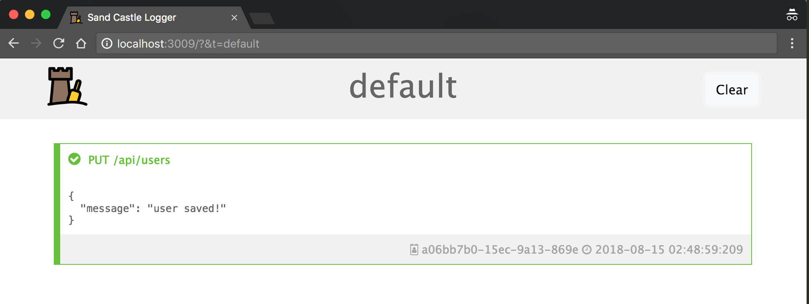

# Sand Castle Logger

<p align="center">
  
</p>

## About

Sand castle logger is a simple realtime logger for your applications.

How it works:

1. Open the dashboard on your browser: <br />
   

2) Send a request to the api: <br />

```
POST http://localhost:3009/api/log/default
Body (application/json)
{
  "metadata": {
    "title": "Api url: /api/users/test",
    "color": "#FF4A1C",
    "icon": "fa-bug"
  },
  "body": {
    "error": "internal_error",
    "error_description": "unable to connect to database."
  }
}
```

3. View the log appears on dashboard: <br />
   

And that's it =).

## Install and Run

We strongly recommend you to use Docker to avoid node version errors.

### NodeJS

-   Clone this repository
-   Run `npm install`
-   Run `npm start`
-   Open `http://localhost:3009` on your browser

### Docker

-   Clone this repository
-   Run `make run`
-   Open `http://localhost:3009` on your browser

Available commands:

-   `make run`: start the service
-   `make run-with-logs`: start the service and keep console logs
-   `make down`: stop the service

## Logging

### Chose your dashboard

After you install and open dashboard on your browser, you now can send logs to it.

When you open the dashboard, realize the token param on url: `http://localhost:3009/?&t=default`.

The `t=default` is customizable. You can set new value like `http://localhost:3009/?&t=potato`. It allow you to have multiple dashboards listening different namespace logs.

The name of this parameter is `namespace token`.

### Send logs to api

After you chose your dashboard (or chose to use `default`), just send a `POST` request to `http://localhost:3009/api/log/{namespace token}`.

The body of the request must be:

```json
{
    "metadata": {
        "title": "this is my title",

        "color": "#FFD5FF",
        "icon": "fa-bug",
        "uuid": "this_is_the_id_1"
    },
    "body": {}
}
```

When:

-   `metadata.`
    -   `title`: the title of the log.
    -   `color` (optional): color of the log (string, default=gray, accepts any that works with css).
    -   `icon` (optional): any [Font-Awesome](http://fontawesome.io/icons/) icon.
    -   `uuid` (optional): some id to let you identify your log.
-   `body`: any `json object` you want to log.

**Ex:** <br />
Dashboard URL: `http://localhost:3009/?&t=my-awesome-app`

API Request:<br />
`POST http://localhost:3009/api/log/my-awesome-app`

```json
{
    "metadata": {
        "title": "PUT /api/users",
        "color": "#63C132",
        "icon": "fa-check-circle"
    },
    "body": {
        "message": "user saved!"
    }
}
```

Will reproduce:



## "Advanced"

If you want, take a look in [Advanced Options](docs/advanced.md)

## Thanks To

**Icon:** <div>Icons made by <a href="http://www.freepik.com" title="Freepik">Freepik</a> from <a href="https://www.flaticon.com/" title="Flaticon">www.flaticon.com</a> is licensed by <a href="http://creativecommons.org/licenses/by/3.0/" title="Creative Commons BY 3.0" target="_blank">CC 3.0 BY</a></div>

## Release Notes

[Take a look](CHANGELOG.md)
